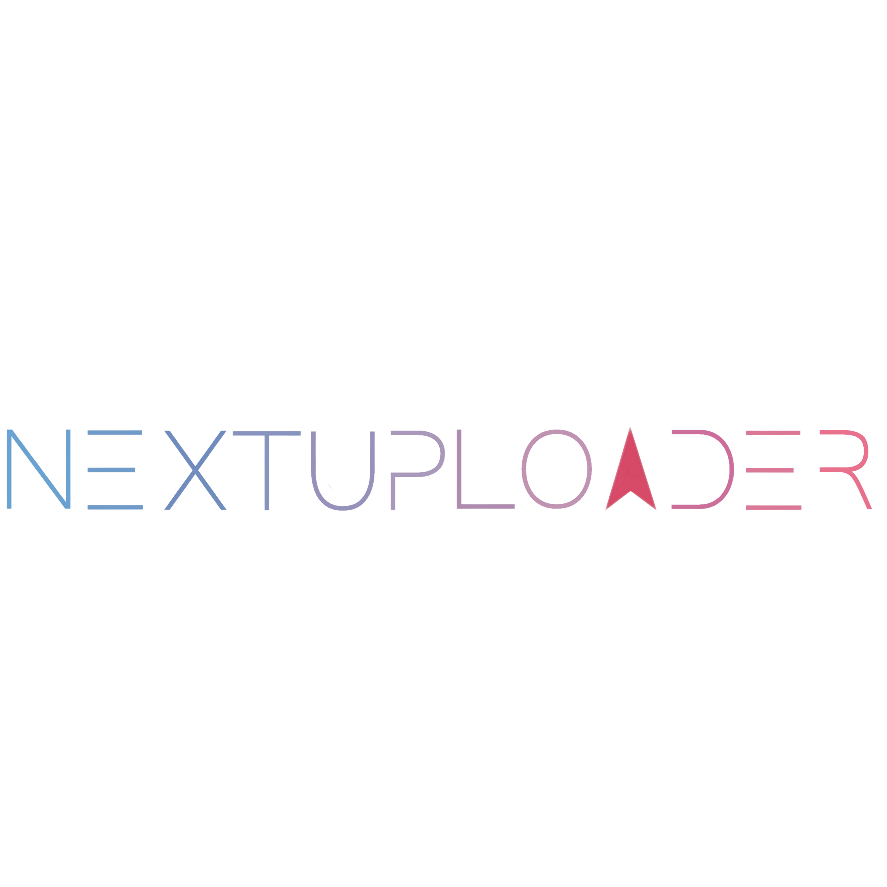

<div align="center">
    
</div>

---

### ⚠️ Warning

Le projet est fourni “en tant que tel" : il existe potentiellement des failles de sécurité, si une faille est connue elle sera patchée quand j'aurai le temps ou via une PR.

<p align="center">
    -- JE NE SUIS EN AUCUN CAS RESPONSABLE EN CAS DE PROBLÈME --
</p>

### 📓 Projet

"next-uploader" est drive personnel permettant la mise en ligne de fichiers en tous genres, pour les personnes authentifiées.

Chaque fichier peut être visualisé ou téléchargé directement depuis n'importe quel navigateur moderne sans être authentifié.
Un mot de passe peut être défini lors de la mise en ligne d'un fichier ou après-coup pour en restreindre l'accès.

### 🛠️ Technos

-   Next.JS
-   Typescript
-   SASS
-   Prisma DB

### 🔜 Prochainement

-   Les fichiers pourront être mis en ligne avec une date d'expiration permettant la suppression automatique et définitive de celui-ci.
-   Il sera également possible de créer des fichiers de tout type (code, traitement de texte, image, vidéo, archive ZIP, etc.) directement sur l’app.

### ✔️ À faire

Lien vers la liste complète des tâches à réaliser : https://sonny93.notion.site/8b1ebf339b7e4502bfd7c5c2d6c4e5a8?v=b86c2192d1ba413ba4c3cb650c615a41

---

### Installation

```
git clone https://github.com/Sonny93/next-uploader.git
npm install
```

Vous devez ensuite copier créer un fichier .env et un fichier .env.local en vous basant sur les deux fichiers d'exemple ".env.example" et ".env.local.example"

```
cp .env.local.example .env.local
```

Pour créer les identifiants Google (GOOGLE_CLIENT_ID et GOOGLE_CLIENT_SECRET), rendez vous sur https://console.developers.google.com/apis/credentials puis

-   Créer un nouveau projet
-   Onglet identifiants -> Créer des identifiants -> "ID Client OAuth"
-   Type d'application : Application Web
-   Origines JavaScript autorisées : Exemple -> "https://uploader.sonnydata.fr"
-   URI de redirection autorisés : Exemple -> "https://uploader.sonnydata.fr/api/auth/callback/google"
-   Puis enregistrer

### Développement

```
npm run dev
```

### Production

```
npm run build
npm start
```
